# MIN-003 — Database Schema Mapping

**Repo:** Movinin
**Models location:** `~/Desktop/movinin/backend/src/models/`
**Database:** MongoDB (via Mongoose)
**Scanned:** 2026-04-29

---

## Models overview

| Model | Collection | Purpose |
|---|---|---|
| User | `User` | Renters, agencies, admins, account management |
| Property | `Property` | Rental properties with details and availability |
| Booking | `Booking` | Rental bookings, payment tracking |
| Location | `Location` | Geographic locations (cities, regions) with hierarchy |
| LocationValue | `LocationValue` | Multi-language location names |
| Country | `Country` | Country containers for location hierarchies |
| Token | `Token` | Auth/password reset tokens (TTL-expiring) |
| Notification | `Notification` | User notifications |
| NotificationCounter | `NotificationCounter` | Per-user unread count |
| PushToken | `PushToken` | Mobile device push tokens |

---

## User
*File: `backend/src/models/User.ts`*

| Field | Type | Required | Default | Notes |
|---|---|---|---|---|
| agency | ObjectId → User | No | null | Self-ref: agency managing sub-agents |
| fullName | String | Yes | — | Indexed, trimmed |
| email | String | Yes | — | Unique, lowercase, email-validated, indexed |
| phone | String | No | null | Optional mobile validation |
| password | String | No | null | Min length 6 |
| birthDate | Date | No | null | — |
| verified | Boolean | No | false | Email verification status |
| verifiedAt | Date | No | null | When email was verified |
| active | Boolean | No | false | Account active status |
| language | String | No | DEFAULT_LANGUAGE | ISO 639-1 alpha-2, lowercase, 2 chars |
| enableEmailNotifications | Boolean | No | true | Email notification opt-in |
| avatar | String | No | null | Avatar URL |
| bio | String | No | null | Trimmed |
| location | String | No | null | Free-text location |
| type | String | No | UserType.User | Enum: Admin, Agency, User |
| blacklisted | Boolean | No | false | — |
| payLater | Boolean | No | true | Allow pay-later |
| customerId | String | No | null | Stripe customer ID |
| expireAt | Date | No | null | TTL — auto-delete unverified Stripe-checkout users |

**Relationships:** Self-ref `agency`. Referenced by Property, Booking, Token, Notification, NotificationCounter, PushToken.

**Indexes:**
- `{ fullName: 1 }`
- `{ email: 1 }` (unique)
- `{ expireAt: 1 }` (TTL)
- `{ type: 1, expireAt: 1, fullName: 1 }`
- `{ type: 1, expireAt: 1, email: 1 }`
- `{ type: 1, expireAt: 1, fullName: 1, _id: 1 }`
- `{ type: 1, expireAt: 1, email: 1, _id: 1 }`

**Validators:** `validator.isEmail` on email, `validator.isMobilePhone` on phone (optional).

---

## Property
*File: `backend/src/models/Property.ts`*

| Field | Type | Required | Default | Notes |
|---|---|---|---|---|
| name | String | Yes | — | — |
| type | String | Yes | — | Enum: House, Apartment, Townhouse, Plot, Farm, Commercial, Industrial |
| agency | ObjectId → User | Yes | — | Indexed |
| description | String | Yes | — | — |
| available | Boolean | No | true | — |
| image | String | No | null | Main property image |
| images | [String] | No | [] | — |
| bedrooms | Number | Yes | — | Integer |
| bathrooms | Number | Yes | — | Integer |
| kitchens | Number | No | 1 | Integer |
| parkingSpaces | Number | No | 0 | Integer |
| size | Number | No | null | sq m / ft |
| petsAllowed | Boolean | Yes | — | — |
| furnished | Boolean | Yes | — | — |
| minimumAge | Number | Yes | — | env.MINIMUM_AGE..99 |
| location | ObjectId → Location | Yes | — | Indexed |
| address | String | No | null | — |
| latitude | Number | No | null | — |
| longitude | Number | No | null | — |
| price | Number | Yes | — | — |
| hidden | Boolean | No | false | — |
| cancellation | Number | No | 0 | Days notice |
| aircon | Boolean | No | false | — |
| rentalTerm | String | Yes | — | Enum: Monthly, Weekly, Daily, Yearly |
| blockOnPay | Boolean | No | true | — |

**Relationships:** N:1 → User (agency), N:1 → Location. Referenced by Booking.

**Indexes:**
- `{ updatedAt: -1, _id: 1 }`
- `{ agency: 1, type: 1, rentalTerm: 1, available: 1, updatedAt: -1, _id: 1 }` (6-field compound — main filter index)
- `{ type: 1, rentalTerm: 1, available: 1 }`
- `{ location: 1, available: 1 }`
- `{ name: 'text' }` (text search, language: 'none')

**Validators:** Custom integer validators on bedrooms/bathrooms/kitchens/parkingSpaces.

---

## Booking
*File: `backend/src/models/Booking.ts`*

| Field | Type | Required | Default | Notes |
|---|---|---|---|---|
| agency | ObjectId → User | Yes | — | Indexed |
| location | ObjectId → Location | Yes | — | — |
| property | ObjectId → Property | Yes | — | — |
| renter | ObjectId → User | Yes | — | Indexed |
| from | Date | Yes | — | Rental start |
| to | Date | Yes | — | Rental end |
| status | String | Yes | — | Enum: Void, Pending, Deposit, Paid, Reserved, Cancelled |
| cancellation | Boolean | No | false | — |
| price | Number | Yes | — | Total |
| cancelRequest | Boolean | No | false | — |
| sessionId | String | No | null | Stripe checkout session ID, indexed |
| paymentIntentId | String | No | null | Stripe payment intent |
| customerId | String | No | null | Stripe customer ID |
| paypalOrderId | String | No | null | PayPal order ID |
| expireAt | Date | No | null | TTL — auto-delete abandoned Stripe checkouts |

**Relationships:** N:1 → User (agency), N:1 → User (renter), N:1 → Property, N:1 → Location.

**Indexes:**
- `{ agency: 1 }`
- `{ renter: 1 }`
- `{ sessionId: 1 }`
- `{ expireAt: 1 }` (TTL)

**No custom validators.** Critical observation: **no double-booking enforcement at the DB layer** — no compound unique index on `(property, from, to)` or overlap-prevention. Conflict prevention is done in the application layer (controller).

---

## Location
*File: `backend/src/models/Location.ts`*

| Field | Type | Required | Default | Notes |
|---|---|---|---|---|
| country | ObjectId → Country | Yes | — | Indexed |
| latitude | Number | No | null | — |
| longitude | Number | No | null | — |
| values | [ObjectId → LocationValue] | Yes | — | i18n names |
| image | String | No | null | Banner |
| parentLocation | ObjectId → Location | No | null | Self-ref hierarchy |

**Relationships:** N:1 → Country, N:N → LocationValue, self-ref `parentLocation`. Referenced by Property and Booking.

**Indexes:** `{ country: 1 }`, `{ values: 1 }`.

---

## LocationValue
*File: `backend/src/models/LocationValue.ts`*

| Field | Type | Required | Default | Notes |
|---|---|---|---|---|
| language | String | Yes | — | ISO 639-1 alpha-2 |
| value | String | Yes | — | Localized name |

**Indexes:** `{ language: 1 }`, `{ value: 1 }`, `{ language: 1, value: 1 }`, `{ value: 'text' }` (text search).

---

## Country
*File: `backend/src/models/Country.ts`*

| Field | Type | Required | Default | Notes |
|---|---|---|---|---|
| values | [ObjectId → LocationValue] | Yes | — | Country names per language |

**Indexes:** `{ values: 1 }`.

---

## Token
*File: `backend/src/models/Token.ts`*

| Field | Type | Required | Default | Notes |
|---|---|---|---|---|
| user | ObjectId → User | Yes | — | Indexed |
| token | String | Yes | — | Hashed token |
| expireAt | Date | No | Date.now | TTL — auto-expire after `TOKEN_EXPIRE_AT` seconds |

---

## Notification
*File: `backend/src/models/Notification.ts`*

| Field | Type | Required | Default | Notes |
|---|---|---|---|---|
| user | ObjectId → User | Yes | — | Indexed |
| message | String | Yes | — | — |
| booking | ObjectId → Booking | No | null | Optional ref |
| isRead | Boolean | No | false | — |

**Indexes:** `{ user: 1 }`, `{ user: 1, createdAt: -1, _id: 1 }` (timeline pagination).

---

## NotificationCounter
*File: `backend/src/models/NotificationCounter.ts`*

| Field | Type | Required | Default | Notes |
|---|---|---|---|---|
| user | ObjectId → User | Yes | — | Unique (1:1) |
| count | Number | No | 0 | Integer-validated unread count |

---

## PushToken
*File: `backend/src/models/PushToken.ts`*

| Field | Type | Required | Default | Notes |
|---|---|---|---|---|
| user | ObjectId → User | Yes | — | Indexed |
| token | String | Yes | — | Expo push token |

---

## Mermaid ER diagram

```mermaid
erDiagram
    COUNTRY ||--o{ LOCATION : contains
    COUNTRY }o--o{ LOCATIONVALUE : translates
    LOCATION }o--o{ LOCATIONVALUE : translates
    LOCATION ||--o{ LOCATION : "parent-child"
    LOCATION ||--o{ PROPERTY : "geo-groups"
    LOCATION ||--o{ BOOKING : "geo-groups"
    USER ||--o{ USER : "agency-subusers"
    USER ||--o{ PROPERTY : owns
    USER ||--o{ BOOKING : "rents/owns"
    USER ||--o{ TOKEN : has
    USER ||--o{ NOTIFICATION : receives
    USER ||--|| NOTIFICATIONCOUNTER : "has-one"
    USER ||--o{ PUSHTOKEN : "registers-devices"
    PROPERTY ||--o{ BOOKING : "reserved-by"
    BOOKING ||--o{ NOTIFICATION : triggers

    USER {
        ObjectId _id
        String email
        String fullName
        String type
        Boolean verified
        Date expireAt
    }
    PROPERTY {
        ObjectId _id
        String name
        String type
        ObjectId agency
        Number price
        String rentalTerm
        Boolean available
    }
    BOOKING {
        ObjectId _id
        ObjectId agency
        ObjectId renter
        ObjectId property
        Date from
        Date to
        String status
        Date expireAt
    }
    LOCATION {
        ObjectId _id
        ObjectId country
        ObjectId parentLocation
    }
    COUNTRY {
        ObjectId _id
    }
    LOCATIONVALUE {
        ObjectId _id
        String language
        String value
    }
    TOKEN {
        ObjectId _id
        ObjectId user
        Date expireAt
    }
    NOTIFICATION {
        ObjectId _id
        ObjectId user
        Boolean isRead
    }
    NOTIFICATIONCOUNTER {
        ObjectId _id
        ObjectId user
        Number count
    }
    PUSHTOKEN {
        ObjectId _id
        ObjectId user
        String token
    }
```

---

## Key design patterns

1. **TTL indexes for cleanup** — `User.expireAt`, `Booking.expireAt`, `Token.expireAt` auto-delete abandoned Stripe checkouts and expired auth tokens. Clean pattern.
2. **Hierarchical locations** — `Location.parentLocation` enables Country → Province → City → District nesting.
3. **i18n via separate `LocationValue` collection** — locations and countries store arrays of `ObjectId` refs to translated names. Heavy on joins (`$lookup`) but avoids duplicating per-language fields.
4. **Aggressive compound indexing on Property** — the 6-field index `{ agency, type, rentalTerm, available, updatedAt, _id }` directly supports the listing-grid filters.
5. **No native double-booking enforcement** — Booking has no overlap-preventing index. Race conditions are possible if the application doesn't lock.
6. **Multi-payment** — Booking model supports both Stripe (`sessionId`, `paymentIntentId`) and PayPal (`paypalOrderId`) on the same row.

---

## Comparison with lctnships schema

| Dimension | Movinin | lctnships |
|---|---|---|
| Database | MongoDB (document) | PostgreSQL (relational) |
| ORM | Mongoose | Raw Supabase queries (no ORM) |
| User roles | `type` enum (Admin/Agency/User) | `user_type` field; renter/host distinction also via Stripe Connect onboarding |
| Multi-tenancy | Application-level checks (`agency` field on Property/Booking) | Postgres Row-Level Security + column grants |
| i18n strategy | Separate `LocationValue` collection (relational style) | App-level via next-intl translation files |
| Conflict prevention | No DB-level lock on Booking | `studio_blocked_dates` + advisory locks (per CLAUDE.md) |
| TTL cleanup | Native MongoDB TTL indexes | Manual cron / no TTL on auth tokens (Supabase manages) |
| Webhook idempotency | Not visible in schema (likely app-level) | `processed_webhook_events` unique-key table |
| Listing model | Generic `Property` (rental real estate) | Domain-specific `studios` (creative studios) with images, availability, blocked dates, equipment |
| Equipment / extras | Not modeled | First-class: `equipment`, `booking_equipment`, `booking_extensions` |
| Reviews | Not in this set of models | First-class `reviews` table |
| Messaging | Notifications only (no chat) | `conversations`, `conversation_participants`, `messages` |
| Credits / wallet | Not modeled | `credits`, `user_credits`, `credit_transactions` |
| Payouts | Not modeled (single-tenant payment) | `payouts` + `transactions` for Stripe Connect |

---

## Takeaways

1. **Movinin's data model is simpler but less feature-rich** — no reviews, no chat, no equipment, no credits, no Stripe Connect payouts. lctnships has more domain depth.
2. **Movinin's DB-level conflict prevention is weaker** — relying on application code for double-booking is fragile under load. lctnships' use of advisory locks is stronger.
3. **Movinin's TTL indexes are a good idea** — for cleaning abandoned Stripe checkouts. lctnships could adopt this pattern (a Postgres scheduled job that deletes abandoned `bookings.status = 'pending'` rows after N hours).
4. **Movinin's per-language LocationValue model** is overkill compared to a translated JSONB column or app-level translation files. Don't copy.
5. **lctnships' RLS + column grants is significantly more secure** than Movinin's role-checks-in-controllers model.
