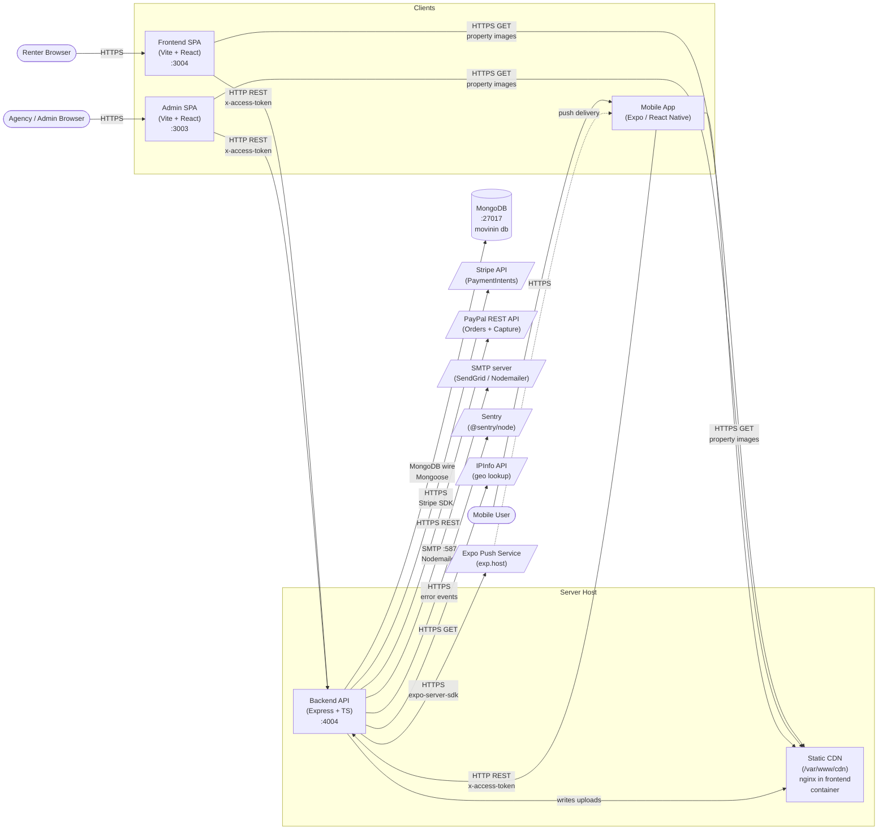
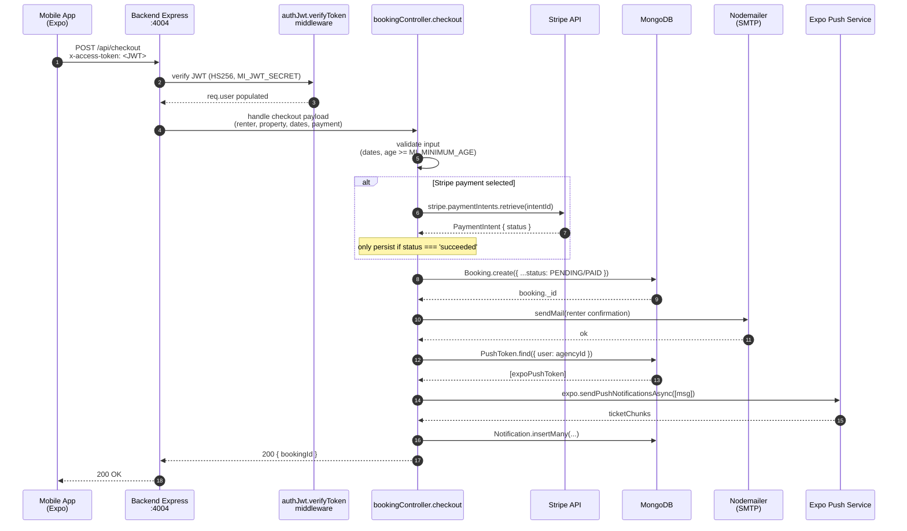
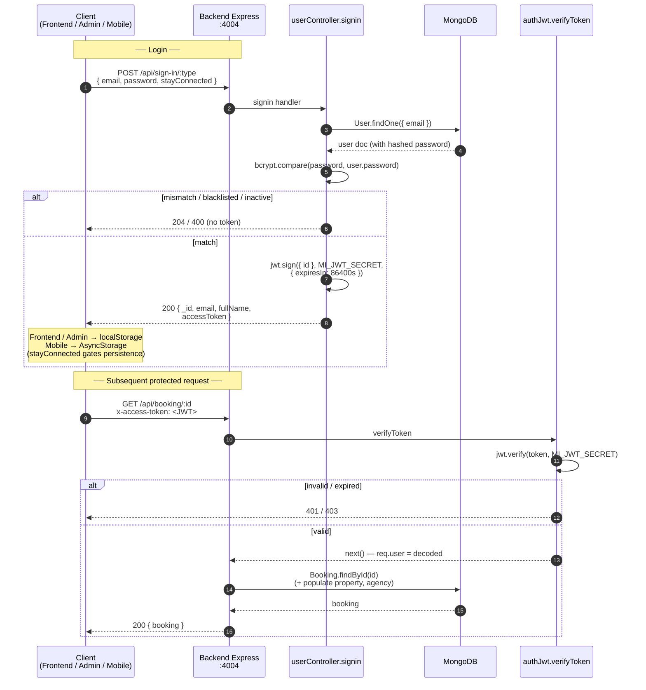

# MIN-011: Movinin Architecture Diagrams

Source: `~/Desktop/movinin/` — verified via `docker-compose.yml`, `backend/.env.example`, `backend/src/app.ts`, `backend/src/controllers/*`, `backend/src/middlewares/authJwt.ts`, and route definitions.

Verified ports: Backend Express API on **4004** (`MI_PORT=4004`), Admin SPA on **3003**, Frontend SPA on **3004** (dev) / 8081 (docker), Mongo on **27017** (host-mapped to 27018).

---

## Diagram 1: System Architecture

**Notable:** Movinin runs as four separate deployable units (frontend, admin, backend, mongo) plus a shared `cdn` Docker volume that the frontend nginx container serves directly — uploads are written by the backend but read straight from disk by clients, no signed URLs. All three clients hit one Express backend; there is no edge/gateway tier and no service mesh.

---

## Diagram 2: Data Flow — Renter Creates a Booking from Mobile

**Notable:** The checkout controller is synchronous — Stripe verification, DB insert, email, and push all happen inside one request before responding. There is no webhook-driven idempotency layer like lctnships uses; instead Movinin relies on a TTL-style cleanup of "temporary" bookings whose Stripe session expires (see comments at `bookingController.ts:230`).

---

## Diagram 3: Auth Flow — Login + Protected Request

**Notable:** Auth is pure JWT in a custom header (`x-access-token`), no refresh tokens and no rotation — `MI_JWT_EXPIRE_AT=86400` (24h) is the only expiry. There is also a parallel cookie-based path for OAuth (Apple/Google/Facebook) that sets an HTTP-only cookie scoped to `MI_AUTH_COOKIE_DOMAIN`, but the email/password path used by all three clients is header-only. Authorization beyond "is logged in" is enforced by separate `authAdmin` and `authAgency` middlewares that re-query the user record.

---

## How lctnships' architecture differs

Lctnships collapses Movinin's split frontend + admin + backend into a single Next.js 16 fullstack app on Vercel: the same codebase serves marketing, renter dashboard, host dashboard, and API routes (`src/app/api/*`), so there is no separate Express tier and no `x-access-token` header — auth is a Supabase session cookie refreshed by middleware. Persistence is Supabase Postgres (managed) instead of self-hosted MongoDB, and authorization is enforced in the database layer via Postgres column-level grants and RLS (e.g. only `service_role` can read `users.stripe_account_id`, only operational columns on `bookings` are user-updatable) rather than Movinin's "JWT-only + per-controller role middleware" model. Payments are Stripe Connect with a 15% platform fee and a webhook-driven idempotent flow (`processed_webhook_events`), versus Movinin's synchronous Stripe + PayPal in-request verification with no webhook ledger. File storage is Supabase Storage with SSRF-validated URLs instead of a shared `cdn` volume served by nginx, and observability/cron come from Vercel + Resend + Upstash rather than Sentry + Nodemailer + a manual scheduler.
